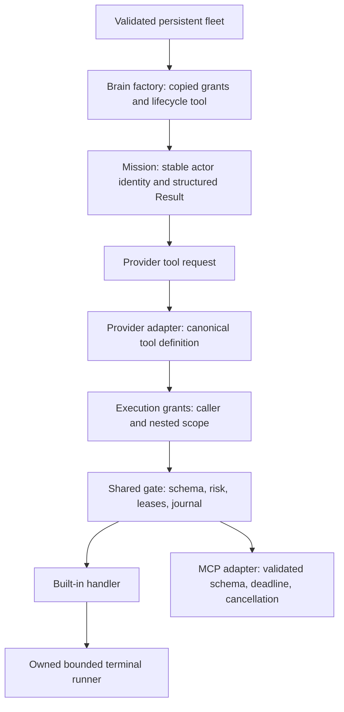

# Tool and agent execution architecture

This change repairs execution boundaries in the existing runtime. It preserves provider adapters, the tool registry, task journals, confirmation policy, and mission scheduling rather than replacing them with another orchestration framework.

## Execution authority

`allowedTools` is authoritative at execution, not just a filter on model declarations. Undefined grants allow all tools; an empty set allows none. Provider constructors snapshot their grants. The recorded run also carries its own snapshot, including during recovery and Claude's long-lived session handoff.

`runGated` checks canonical names before project lookup, resource acquisition, confirmation, or handler execution. `tool-permissions.ts` carries nested scopes through AsyncLocalStorage; a nested dispatcher intersects authority with its caller instead of resetting it. Concurrent brains do not share grants. Refused calls retain a structured `tool_not_granted` outcome and, for active recorded tasks, an invocation in task history.

Claude's SDK-native tools remain behind `canUseTool`. Only Echo's `mcp__jarvis__` namespace maps to local grant names. An outside MCP tool cannot borrow a local permission by having the same basename. OpenAI/OpenRouter, Gemini, and Ollama also filter external declarations. Agents without external grants skip MCP connection startup entirely.

## Custom agents and mission ownership

Persisted fleet records have a versioned strict schema, unique non-reserved identities, bounded fields, a roster cap, valid tiers, and `custom: true`. Tools are restricted to current registry read-only grants. Invalid files expose no custom agents and cannot be overwritten by an editor mutation; the file is preserved for repair. Saves use the existing atomic, fsynced, private-file writer. Returned roster objects cannot mutate built-in definitions.

A missing profile is a failure, never an unrestricted default brain. A custom mission agent receives its requested read-only grants plus `submit_agent_result`. That lifecycle tool can only submit the invoking actor's own delegated task result and keeps the existing artifact/evidence requirements.

The swarm owns brains by stable actor ID. A display name resolves only when unambiguous; callers can use the actor ID when multiple tasks share a profile. Completed, cancelled, or timed-out agents release their provider resources. Initialization failures become durable failed outcomes and block downstream dependencies. Recovery initialization failures return a failed result rather than crashing scheduling.

## Terminal ownership

`system/terminal.ts` owns synchronous commands, independently of provider wire formats. It validates cwd, allows at most four simultaneous commands, retains at most 64,000 characters of combined stdout/stderr, preserves real exit codes and signals, and enforces a 120-second default deadline (maximum ten minutes). Persistent servers should use the existing managed `start_process` tool.

Terminal and managed coding processes share `executionEnvironment`: basic OS execution variables are inherited; Echo's provider and deployment credentials are excluded. This is credential hygiene, not filesystem isolation. Commands still run with the user's filesystem permissions.

On POSIX, each terminal command gets its own process group. Timeout and cancellation send TERM followed by KILL; shell exit also terminates remaining group members. A recorded brain's abort signal cancels its terminal command, including cancellation during cwd preparation. App shutdown cancels all active terminal commands and refuses new starts.

`sandbox:true` remains a working-directory copy, with a bounded copy command. Tool descriptions now state correctly that absolute paths, symlinks, and network access can reach outside it. It is not an OS sandbox.

## MCP lifecycle and argument contracts

The MCP adapter retains the server's input schema and validates it locally through AJV before any remote call, using draft 2020-12 by default or the server’s declared draft-07/2019-09 dialect. Definitions and compiled validators are cached by discovered handle. Invalid arguments, or a schema that cannot be compiled, fail before contacting the server.

Connections own transports before startup/discovery can wait. Global shutdown marks each connection closed as well as closing its clients, so late discovery cannot resurrect a server. Each call gets an SDK cancellation signal and a deadline. Timeout is an explicit, non-retryable `timeout` result; interruption after dispatch is `uncertain`. Cancellation does not prove that a remote side effect was undone, so callers must verify remote state before retrying. Existing resource quarantine behavior receives these statuses.

## Verification and limits

`toolarchitecturetest` uses scripted adversarial OpenAI/OpenRouter and Gemini model responses, Ollama's actual dispatcher, and Claude's actual permission hook. It checks hidden writes, nested escalation, local/MCP namespace collisions, input validation, cancellation, late discovery, corrupt roster handling, duplicate-name isolation, resource cleanup, and real terminal processes. The existing `codingproviderstest` additionally exercises Claude's in-process MCP client/server and both Responses adapters.

Tests are isolated and offline. They verify dispatch and lifecycle behavior; they do not measure live model reasoning, provider credentials, all configured remote tools, or end-to-end production latency. Custom agents retain the existing read-only resource policy. This change does not introduce an OS sandbox, arbitrary write grants for custom profiles, or guaranteed completion of every generated application.
