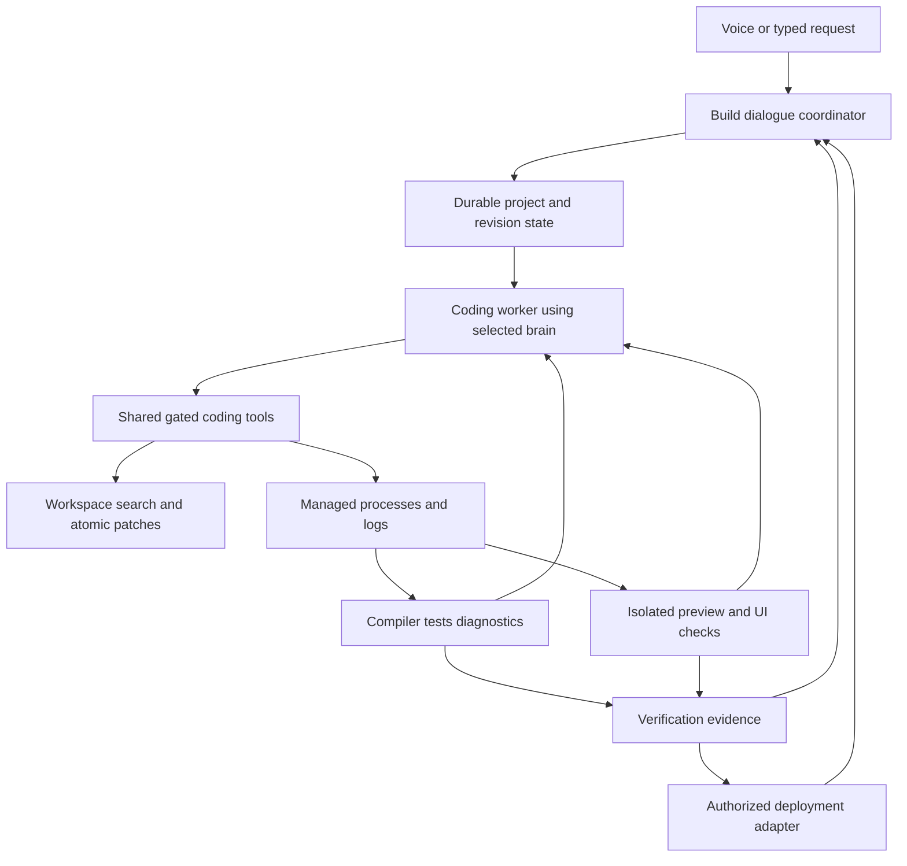

# Echo voice coding: audited implementation plan

Status: proposal, not implemented. Audit date: 2 October 2026.
Scope: a nontechnical user can describe, build, inspect and revise a website,
web app or desktop application by voice, with questions, suggestions, working
previews, diagnostics, repairs and optional deployment. The same workflow must
work with supported current and future brain adapters. Language support means
verified toolchain adapters; it cannot mean every platform/toolchain works on
this Mac or every workload deploys to Vercel.

## What exists, and what it actually proves

| Existing capability | Evidence in Echo | Limit that matters for coding |
|---|---|---|
| Five text brains, Live voice, shared tool registry/gate | `src/brain/index.ts`, `src/voice/realtime.ts`, `src/tools/registry.ts` | Tool availability is not equivalent to model coding quality or available quota. Claude SDK-native tools need the same project policy as Echo tools. |
| Shell commands with exit/stdout/stderr | `src/tools/registry/system.ts`, `run_terminal_command` | Uses `exec` and waits for completion; no session ID, streaming/polling/stdin or dev-server lifecycle. Outer `withDeadline` in replay runtime rejects without terminating the process. |
| Read/write files | Same file, `read_local_file` / `write_local_file` | Reads silently slice at 10,000 characters; writes overwrite the file synchronously. No typed paginated repo search, atomic patch or stale-content conflict protection. |
| Git worktree creation | `src/tools/registry/agents.ts`, `create_worktree` | Temporary checkout; shell interpolation of a model-supplied branch requires replacement by argument-array execution. Worktree isolation is not filesystem/process containment. |
| Copied-directory experiment | Terminal's `sandbox:true` | A copy protects the original cwd from ordinary relative edits; the subprocess still has normal host permissions. It is not an OS security sandbox. |
| Persisted tasks, plan updates, results, leases, checkpoints | `src/memory/task-state.ts`, `src/agent-replay/runtime.ts` | Must extend to project revisions, patch ownership, process IDs, preview and deployment state; a resumed model must not launch duplicate servers/deployments. |
| Delegation, fleet and missions | `src/frontier/fleet.ts`, `fleet-brain.ts`, `swarm.ts` | Existing fleet roles are not a coding workflow. Deep tier currently pins Claude; availability/coding capability should be configurable. Concurrent writers need coordination. |
| Basic verification | `verify_task` in registry/agents | File exists/contains/absent and screen contains; does not prove build, test, HTTP health or a user journey. |
| Screen/app/browser interaction | `src/tools/registry/screen.ts` | `open_url` opens the default browser. No project-aware embedded preview with DOM, console, network and test evidence. |
| Voice dialogue, interruption and queued turns | `src/main.ts`, `src/brain/turn-queue.ts`, `src/safety/confirm.ts` | A build-specific question/answer coordinator must distinguish clarification, a feature change, status, pause and cancellation. Permission confirmations are not product-design questions. |
| Dataset/run evidence | `src/learn/dataset-export.ts`, replay recorder | Extend records with build-session/project/revision and diagnostic/test/deployment evidence; maintain separation of raw activity and reviewed benchmark data. |
| Vercel | Source/config search found no first-party integration | User token, team/project linking, deployment lifecycle, log reading and URL verification are still to implement. Generic Composio connectivity does not establish Vercel capabilities. |

Machine audit: previously established M2/8 GB; current filesystem check shows
about 6.5 GiB available. PATH contains Node, Python, Git, Swift, Cargo, Java,
Ruby and Clang commands; Go and .NET were not found in this shell. Presence on
PATH is not proof of a usable SDK/compiler (especially macOS Java stubs).
No language project was compiled or dependency installed in this planning audit.

## The user experience

Example: “Echo, build a booking app for my salon.” Echo asks a small number of
blocking questions (booking workflow, owner/customer roles, desired look and
whether this is a prototype or real business app), offers concrete defaults,
and starts a working vertical slice. It talks briefly while building without
reading logs aloud. The user can say “make it dark”, “add calendar booking”,
“show me”, “why did it fail?”, “undo the last change”, “pause”, or “continue
this project tomorrow”. Choices and acceptance criteria survive restarts.

Ask when a choice changes architecture or real behavior: authentication,
payments, data storage, external APIs, destructive schema changes, missing
assets/keys, target OS, deployment visibility. Routine file edits/tests already
covered by the build request should proceed. Public deployment follows the
user's explicit instruction or saved project policy; do not silently publish
merely because a local preview was requested.

The first acceptance target is a complete web flow: build a site, show it,
revise by voice, reproduce and fix an intentional bug, restart/resume, and
optionally obtain a verified Vercel preview URL. Then extend the same core to
full-stack and desktop targets. No promise of bug-free output or universal
language/platform support.

## Architecture decisions

1. **Project session rather than a larger prompt.** Store project root, spec,
   target OS/language/framework, design tokens/assets, architecture decisions,
   acceptance criteria, plan, revision, branches/diffs, known diagnostics,
   running processes, preview URL and deployment identity. Reuse the existing
   task coordinator and conversation store. Build state has explicit phases:
   clarifying, planning, implementing, waiting-for-input, verifying, previewing,
   deploying, completed, blocked, failed and cancelled.
2. **Separate voice responsiveness from build work.** A foreground dialogue
   coordinator answers questions/status while a budgeted coding worker runs.
   The selected supported brain performs code work; a single-worker default
   avoids multiple heavy local models. Pass queued feature changes at safe
   edit/build boundaries, increment revisions, and reject stale patch/test
   results. User interruption is distinct from aborting the entire project.
3. **A small provider-neutral coding tool surface.** Proposed tools:
   `open_project`, `inspect_project`, `search_project`, `read_project_file`,
   `apply_project_patch`, `project_diff`, `start_process`, `read_process`,
   `write_process_input`, `stop_process`, `run_project_checks`,
   `start_project_preview`, `inspect_preview`, `inspect_diagnostics`,
   `ask_build_question`, `deploy_project`, `inspect_deployment`.
   All share registry schemas, risk/project policy, typed success/failure,
   ownership/cancellation and replay records. Arguments and execution reach
   the same gate for Claude SDK-native tools. Generic shell remains an escape
   hatch with explicit cwd and the same policy, not the main coding interface.
4. **Reliable edits.** Workspace-bound canonical paths, symlink handling,
   paginated/ranged reads and ignore-aware search; atomic patches require an
   expected content hash, preserve encoding and fail visibly on mismatch.
   Surface conflicts instead of overwriting user changes. Git checkpoints and
   reversible diffs are project-owned; no reset of unrelated uncommitted work.
5. **Managed execution.** Use argument-array spawning for known recipes and a
   project-scoped shell only where necessary. Persist session handles, creation
   identity, cwd, stdout/stderr cursors, exit status, port/readiness and limits.
   Support stdin/PTY where needed, log rotation, timeouts, cancellation and
   process-group teardown. Polling a task state must not hold a lease that
   prevents the user from stopping its process. Cwd isolation is not security
   containment; strong containment needs a suitable sandbox/remote runner.
6. **Language adapters.** Each recipe declares detection, toolchain probe,
   scaffold, dependency plan, format/lint/typecheck/build/test commands, error
   parser, run/preview readiness and deploy/package capabilities. Existing
   projects retain their language and commands. Start with web JavaScript/
   TypeScript and Python; extend to verified macOS desktop recipes, then other
   languages. Swift native, Rust/Tauri and Electron are different adapters,
   not interchangeable terminal commands. Windows/Linux packaging requires
   compatible build environments; mobile targets require their SDK/simulator
   support. Missing SDKs are reported before installation or build promises.
7. **Preview and evidence.** Prefer a local preview first; Vercel is not required
   to show a web page. A separate browser surface displays the app; collect DOM,
   console/page exceptions, failed requests, screenshots and interaction results.
   Generated/remote content gets no Echo preload, Node access or unrestricted
   IPC. Use origin/permission/navigation controls. For desktop, retain process
   handles, launch the resulting app/window, capture logs and use accessibility
   checks where available. A visible window alone is not functional proof.
8. **Repair loop with stopping conditions.** Reproduce the failure, capture
   diagnostics, read relevant code, make a minimal patch, rerun the failed check
   and relevant regressions. Track issue signature plus project revision and
   attempted approaches. Repeated identical failures must stop looping and
   surface a specific blocker or new hypothesis. Never turn off a failing test,
   swallow errors or report success solely because the process started.
9. **Vercel as an adapter.** Store the token through existing key management,
   privately select team/project, and validate access. Use Git-linked or
   file-upload REST deployment according to project state; keep one transport
   abstraction rather than divergent CLI/API logic. Track commit/revision,
   deployment ID, status, logs, URL, target and retries. Poll the exact
   deployment until ready/error, inspect build errors, and verify the preview
   URL (including deployment protection) before speaking/showing it. Do not
   expose credentials/bypass tokens in URLs or logs. Production promotion is a
   separate authorized target. Local desktop apps are launched/packaged locally;
   Vercel is not a desktop-app execution environment.
10. **Backends and dependencies.** Real auth, databases, uploads, payments and
    workers need suitable services/configuration. Do not silently replace real
    requirements with mock data. Select a deployment compatible with the chosen
    workload and account; unsupported targets use another adapter or a split
    frontend/backend deployment. Pin project dependencies and retain lockfiles.
11. **M2 resource policy.** Start with one build/install and one coding writer,
    one local preview and browser; read-only review may run concurrently within
    budgets. Stream logs off the UI path and return bounded diagnostic excerpts.
    Do not start a new local inference server by default. Preflight actual free
    disk/toolchain/cache needs, cap workers/log retention and stop only verified
    project-owned processes. Heavy builds can use a remote worker later. The
    current free disk is limited; do not install all possible language SDKs.
12. **Capability-aware brains.** Tool access is shared, but coding ability,
    context limits, streaming/tool-call formats and quota differ. Expose clear
    capability profiles and use a user-selected coding model with adequate
    capacity. Configurable fallback may resume saved state when authorized;
    exhausted account quotas should not cause repeated coding retries. Future
    adapters must pass the common build tools/context/replay conformance suite.

## Ordered delivery and checkpoints

The detailed tasks and verification criteria are in `tasks/todo.md`.

| Stage | Tasks | Deliverable/checkpoint |
|---|---|---|
| Foundation | 1–4 | Isolated project, safe edit/diff, managed command lifecycle and resumable state |
| First usable voice web builder | 5–8 | Requirements dialogue → site → local preview → voice revision → verified bug repair |
| Full-stack and deployment | 9–10 | Real backend flow and verified Vercel preview, including a failed-deployment repair |
| Desktop and broader languages | 11–12 | Build/run/show one macOS desktop application, toolchain-aware extensibility |
| Reliability and release | 13–14 | Restart/cancel/provider/resource tests and benchmark/evidence review |

Implement vertical slices. First a tiny generated website; then a web app with
one complete data flow; then desktop. Test the end-to-end voice loop early,
without waiting for Vercel credentials. Do not expand to every framework before
this loop works reliably. Estimates should follow the first process/preview
spike; this audit cannot justify a precise completion date.

## Release acceptance and benchmarks

- A novice can request a small project, answer questions and get a functioning
  local result with no manual terminal commands.
- User-requested style/feature changes preserve existing functionality and
  can be undone without losing unrelated files.
- Intentional syntax, type, dependency, UI/console and API failures are
  reproduced and repaired; impossible/missing-service cases report blockers.
- Pause/cancel stops owned work and servers; reopening resumes the correct
  revision without duplicate side effects, dev servers or deployments.
- Tests show every current brain gets the same coding tools and meaningful
  statuses; a future adapter fixture preserves provider identity and evidence.
  Actual live-model trials separately measure model quality rather than assume
  parity from schema fixtures.
- A Vercel preview reaches readiness, passes application checks and is shown;
  deployment rejection/protection/cost or unsupported runtime is handled honestly.
- A macOS desktop example compiles, opens a window and passes its core flow.
- Measure end-to-end completion rate, first acknowledgement/first preview,
  correction success, voice recognition corrections, wasted tool calls,
  benchmark leakage, peak memory/disk and UI responsiveness on the actual M2.
  Agree numerical targets after baseline measurements; do not invent accuracy
  percentages. UI stays responsive and voice remains interruptible during builds.

Evaluation projects should include a static landing page, a CRUD web app,
an existing repository change, a seeded-bug repair and a macOS desktop utility.
Add independent user-flow assertions and keep entire tasks/projects separate
between tuning and held-out evaluation. Generated tests that merely mirror the
implementation and automatically labelled success traces are not gold evidence.

## Dependencies and decisions to collect during implementation

Vercel token + correct account/team/project permissions are needed only at the
Vercel stage. Collect securely through settings rather than voice. The first
prototype can preview locally. Confirm primary desktop target (assume macOS
because this device is a Mac), preferred coding brain, project destination,
prototype-vs-production requirements and budget policy when those decisions
become necessary. Database/auth/provider keys are project-specific. No need to
ask a novice to choose a programming language unless they have a preference.

## Official references checked for this plan

- [Vercel deployments](https://vercel.com/docs/deployments): CLI/Git/API methods,
  preview vs production and deployment verification. REST file deployment uses
  uploaded file hashes/references; do not assume an arbitrary local folder URL.
- [Vercel REST API](https://vercel.com/docs/rest-api): projects, uploads,
  deployments and deployment events. Endpoint versions/capabilities must be
  validated when implementing rather than copied from outdated snippets.
- [Vercel runtimes](https://vercel.com/docs/functions/runtimes): select compatible
  runtimes/workloads; available hosting options/account capabilities can evolve.
- [Playwright](https://playwright.dev/docs/intro): browser interaction assertions
  and evidence. Use one browser/worker initially to fit this device.
- [Electron security](https://www.electronjs.org/docs/latest/tutorial/security):
  isolated untrusted preview content, no Node integration or privileged preload.

No implementation, installations, deployment, credential changes or running
project modifications were performed by this planning audit.
